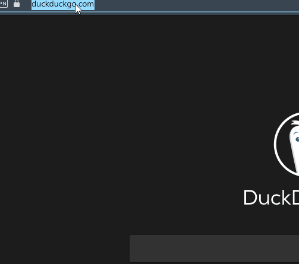

    
    
    
    
    

# InstaLike
## Description

Get a clickable Instagram link from someone's Tinder bio on the web.

[Back To The Top](#InstaLike)

#### Tecnologies

- Vanilla Javascript
- Chrome Extensions

## Instalation

Clone/download this repository into your computer.
Open your Chromium based web browser's extension page(usually at chrome://extensions)

Click on Load Unpacked Extension and choose the folder you cloned/downloaded.

## How To Use

Find a Tinder profile with the Instagram handle in the bio.
Double click the Instagram handle.
The Instagram link will appear below the bio.
Just click the link.

[Back To The Top](#Reddit-API-to-JSON)

## License

MIT License

Copyright (c) 2020 Alisson Leal

Permission is hereby granted, free of charge, to any person obtaining a copy
of this software and associated documentation files (the "Software"), to deal
in the Software without restriction, including without limitation the rights
to use, copy, modify, merge, publish, distribute, sublicense, and/or sell
copies of the Software, and to permit persons to whom the Software is
furnished to do so, subject to the following conditions:

The above copyright notice and this permission notice shall be included in all
copies or substantial portions of the Software.

THE SOFTWARE IS PROVIDED "AS IS", WITHOUT WARRANTY OF ANY KIND, EXPRESS OR
IMPLIED, INCLUDING BUT NOT LIMITED TO THE WARRANTIES OF MERCHANTABILITY,
FITNESS FOR A PARTICULAR PURPOSE AND NONINFRINGEMENT. IN NO EVENT SHALL THE
AUTHORS OR COPYRIGHT HOLDERS BE LIABLE FOR ANY CLAIM, DAMAGES OR OTHER
LIABILITY, WHETHER IN AN ACTION OF CONTRACT, TORT OR OTHERWISE, ARISING FROM,
OUT OF OR IN CONNECTION WITH THE SOFTWARE OR THE USE OR OTHER DEALINGS IN THE
SOFTWARE.

[Back To The Top](#read-me-template)

---

## Author Info

- Twitter - [@alissonsleal](https://twitter.com/alissonsleal)
- Discord - [Alisson#0629](https://discord.com/)
- StackOverflow - [Alisson Leal](https://stackoverflow.com/users/14122260/alisson-leal)

[Back To The Top](#read-me-template)
